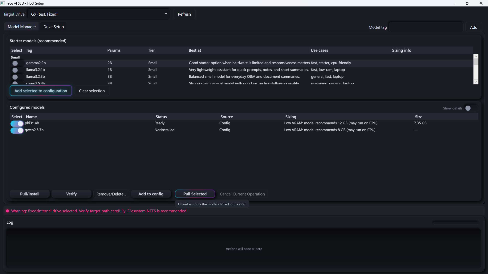
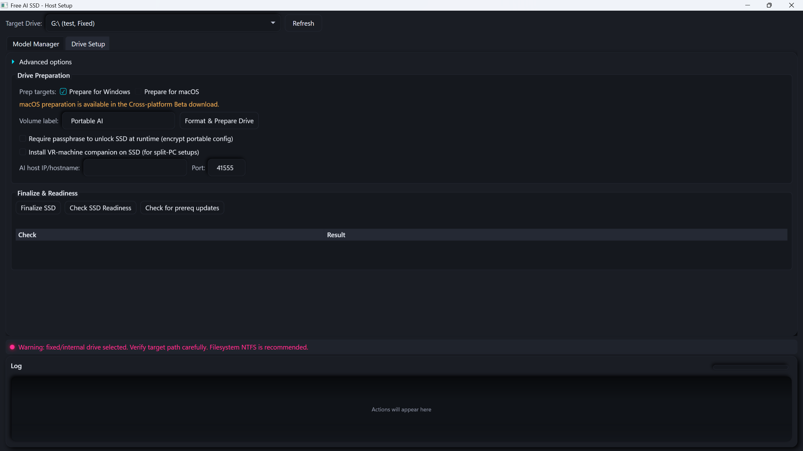

<p align="center">
  
</p>
<p align="center">
  
</p>

*Prep App — Model Manager (top) and Drive Setup (bottom). Runner screenshots coming once live-drive testing is complete.*

# Free-AI-SSD

**Plug in a drive. Ask your AI anything. No internet required.**

Prepare the drive once on a machine with internet access — download the models, load in your documents. Then plug it into any Windows or macOS machine and you have a fully self-contained AI assistant that runs 100% offline. It references your own files when answering, so you get grounded responses instead of hallucinated guesses.

- **Portable** — everything runs from the SSD; no install required on the target machine
- **Document-grounded** — load your PDFs, manuals, and notes; the AI cites them when answering
- **HOTAS-aware** — import your DCS bindings; get answers using your actual stick and throttle layout
- **Offline voice** — speak your questions, hear the answers; speech-to-text and TTS run fully locally

**Quick start:** download from [Releases](../../releases), run `FreeAiSsd.PrepApp.exe`, then follow [Setup & Installation](#setup) below. There's also a quickstart text file at [`docs/QUICKSTART.txt`](docs/QUICKSTART.txt) for a condensed version.

---

## Origin story

This started as a way to take AI into the field with no cell signal — ham radio manuals, band plans, and reference docs loaded onto a pocket SSD so an LLM could answer questions about them miles from civilization. Then it turned out the same setup works really well as a voice-activated copilot in DCS: load aircraft manuals, import your HOTAS bindings, and hit a button on the throttle to ask questions mid-sortie without taking the VR headset off. Same drive. Same AI. Same offline-first idea.

---

## Features (current state)

- ✅ **Portable offline AI** — Ollama staged on the SSD, bound to loopback only
- ✅ **Cross-platform runtime** — Windows 10/11 (WPF Runner) and macOS (Swift Runner, beta)
- ✅ **RAG document library** — PDF / TXT / MD / JSON / CSV, with inline source citations
- ✅ **DCS World bindings parser** — auto-detects Saved Games, scans aircraft, merges stick/throttle/pedals into per-aircraft reference docs
- ✅ **Voice input (Whisper.cpp)** — fully local STT; Tiny / Base / Small / Medium models
- ✅ **Voice output (TTS)** — Windows SAPI or Piper neural TTS; per-device audio routing
- ✅ **HOTAS Push-to-Talk** — DirectInput joystick button triggers record → transcribe → send → TTS, hands-free
- ✅ **Network Mode** — authenticated LAN HTTP API for chat, streaming chat, STT upload, host-side TTS, and voice-query orchestration
- ✅ **Companion tray app** — lightweight Windows client for a second PC on the LAN (no SSD required on the client)
- ✅ **Headless CLI (`FreeAiSsd.RunnerCli`)** — terminal REPL for SSH / Tailscale access; streams chat, shows RAG sources, zero GUI deps
- ✅ **Offline prereq bundle** — .NET 8 Desktop Runtime + VC++ redist staged and SHA-verified so Runner installs cleanly on fresh targets

Known gaps:
- Network voice upload currently supports WAV (PCM 16-bit mono 16kHz) and raw `pcm16le`; other codecs not implemented.
- Direct Ollama LAN exposure is intentionally not supported — Runner API is the only network surface.

Note: Remote HOTAS/PTT is supported via the Companion tray app — HOTAS PTT can run on the client machine and drive the full voice loop against Runner over LAN. TTS playback defaults to the host machine running Runner; Companion clients can opt in to local playback by passing `returnAudio=true` on `/api/voice/query`.

### SSH / Tailscale access (CLI)

For headless access from a terminal (including an iPad over Tailscale), the `FreeAiSsd.RunnerCli` binary ships alongside Runner. It's a thin HTTP client against Runner's LAN API — same RAG pipeline, same source citations, but no GUI.

```
$ FreeAiSsd.RunnerCli --help
$ FREEAI_URL=http://my-desk:41555 FREEAI_API_KEY=... FreeAiSsd.RunnerCli --model phi3
Target: http://my-desk:41555
Host reachable (ollamaRunning=True). Type /help for commands. Ctrl-C or 'exit' to quit.
phi3> what aircraft can I fly in DCS Open Beta?
...streamed response...
— sources: dcs-aircraft-list.pdf
phi3> /quit
```

Precedence for configuration: `--url` / `--api-key` flag > `FREEAI_URL` / `FREEAI_API_KEY` env var > default (`http://127.0.0.1:41555`, no key). No TUI libraries — plain `Console.ReadLine`, so it's robust over spotty SSH connections. Use `--no-stream` on very flaky links to fall back to a single-response round-trip.

---

<details>
<summary>🎮 Use Case: Flight Sim Copilot (DCS World)</summary>

You're in VR, mid-sortie, and can't remember the sequence to uncage an AIM-9. You reach for your HOTAS, key the mic, and ask. The AI answers with the buttons on *your* stick — sourced from the aircraft manual sitting on the drive. No internet. No cloud. No subscription.

**What it does for flight sim:**
- Load aircraft manuals (PDF) so the AI can answer procedures, systems questions, and limitations from the actual document
- Import your HOTAS bindings from DCS — it auto-detects your `Saved Games\DCS` folder, scans your aircraft, and writes a per-aircraft reference file with your real button assignments
- Ask by voice while in VR — no headset off, no hands off the stick
- Hear the answer spoken back through your headset via TTS, routed to any audio device you choose

**Supported now:** DCS World (stable and Open Beta), any aircraft with binding files in `Config/Input`, multi-device merging (stick + throttle + rudder pedals)

**Planned:** IL-2 Sturmovik and War Thunder binding parsers (see Roadmap)

</details>

<details>
<summary>📻 Use Case: Ham Radio / Field Reference</summary>

Camping, deployed for emergency comms, or away from a desk — you need to reference your radio manual or band plan and there's no cell signal.

Load your manuals and reference documents onto the drive before you go. The AI indexes everything and answers from your own library, completely offline, from a drive that fits in your pocket.

</details>

<details>
<summary>🔒 Use Case: Private Offline AI Assistant</summary>

Maybe you don't trust cloud AI with your data. Maybe your workplace restricts internet access. Maybe you want the same setup on every machine you sit down at.

Prepare the drive once. Plug it in anywhere. Your models, your documents, your config — nothing leaves the drive, no account needed, no telemetry.

</details>

<details>
<summary>🏕️ Use Case: Survival / Emergency Reference</summary>

Load first aid guides, plant identification references, equipment specs, survival manuals — whatever you need when there's no connectivity. The AI indexes it all and answers from your library when you're completely off-grid.

</details>

---

<a name="setup"></a>

<details>
<summary>📦 Setup & Installation</summary>

### What You Need

- A portable SSD (most models need 4–8 GB for the AI models alone; plan accordingly)
- A Windows machine with internet access for the one-time preparation step
- The target machine needs no pre-installed software — Runner handles prerequisites offline

### Download

**Stable (recommended):** Download `Free-AI-SSD-win.zip` from [Releases](../../releases). Extract anywhere on Windows. Run `FreeAiSsd.PrepApp.exe`.

**Beta cross-platform bundle:** `Free-AI-SSD-beta-crossplatform.zip` includes macOS artifacts. The macOS build is currently unsigned/not notarized — expect Gatekeeper prompts.

**CI artifacts:** Available from GitHub Actions for validation and testing. Prefer Releases for normal use.

### First Run Walkthrough

**Phase 1 — Prepare (online, once):**

1. Open `FreeAiSsd.PrepApp.exe`
2. On **Drive Setup**, select your target external SSD and enter a volume label
3. Click **Format & Prepare Drive** (optional — skip if the drive is already formatted the way you want). PrepApp will prompt for admin elevation, re-confirm, then format the volume and lay out the canonical directory structure. If Windows asks to relaunch as admin, accept — the elevated window auto-resumes with your label pre-filled and asks you to confirm once more before formatting.
4. On **Model Manager**, add or select models and pull them
5. Run **Check SSD Readiness** until checks pass
6. Click **Finalize SSD**

**Phase 2 — Run (offline, anywhere):**

1. Plug the SSD into the target machine
2. Run Runner directly from the SSD:
   - Windows: `<SSD>\windows\runner\FreeAiSsd.Runner.exe`
   - macOS (beta): `<SSD>/mac/Runner.app`
3. Load your documents and start chatting

### What Needs Internet vs. What Doesn't

| Operation | Internet Required? |
|---|---|
| PrepApp — download, pull, staging | Yes |
| Runner start / chat | No |
| Reference Documents indexing and retrieval | No |
| Pull embedding model (if missing from SSD) | Once |
| DCS Bindings Import | No |
| Voice input (Whisper transcription) | No (model download is once) |
| Text-to-speech | No |

### Troubleshooting

**Runner won't start / dependency warnings**
- Use Runner's **Re-run dependency check**
- If the prereq bundle is missing or invalid, reconnect online and run **Update Prereqs** in PrepApp

**Missing embedding model while offline**
- Start the AI engine and click **Pull embedding model**
- If fully offline, connect temporarily to download it, then return offline

**PDF citations seem wrong or sparse**
- Confirm the PDF has a machine-readable text layer
- For scanned or image-only PDFs, run OCR externally before importing

**.NET / runtime prerequisites on target machine**
- Runner can install staged prerequisites offline when the bundle is valid
- If install is blocked, refresh prerequisites from PrepApp while online and retry

### Prereq trust model

Every prerequisite and bundled third-party tool is fetched, verified, and recorded at runtime via a single shared resolver (`shared/Prereqs/PrereqResolver.cs`) used by both PrepApp and the CI offline-bundle builder (`tools/FreeAiSsd.PrereqFetch`). There are no hardcoded per-version SHA pins in the workflow or the catalog — stale pins were the failure mode we were hitting most often. Instead:

| Upstream | Version discovery | Integrity check | Trust basis |
|---|---|---|---|
| **.NET 8 Desktop Runtime (x64)** | `https://builds.dotnet.microsoft.com/dotnet/release-metadata/8.0/releases.json` → `latest-release` (rejects preview/rc builds) | SHA-512 from the same `releases.json` entry | Vendor-published hash over HTTPS to Microsoft's CDN |
| **VC++ Redistributable (x64)** | `https://aka.ms/vs/17/release/vc_redist.x64.exe` evergreen permalink | Observed SHA-256 recorded in manifest only | HTTPS-only trust to Microsoft aka.ms (no vendor per-version hash is published at a predictable URL) |
| **Ollama (macOS, universal)** | GitHub API `releases/latest` → picks `Ollama-darwin.zip` / `ollama-darwin.zip` asset | SHA-256 from the release's `sha256sum.txt` asset | Vendor-published hash over HTTPS to github.com |

Fail-closed invariants (CI and PrepApp both enforce):
- Any non-HTTPS URL anywhere in the chain is rejected before download begins
- A missing or unparseable hash source aborts the bundle
- A SHA mismatch deletes the temp download and throws — no partial installer ever reaches the prereq directory
- Preview / RC .NET builds are refused even if Microsoft publishes them as `latest-release`

The `prereqs-manifest.json` that ships on the SSD records the resolved upstream URL, the vendor hash (when one was available), the observed SHA-256, and a short `trustNote` describing which trust basis was used — so offline installs can be audited without calling back to the upstream.

</details>

---

<details>
<summary>📄 Document Library & RAG</summary>

Runner includes a **Reference Documents** panel. Add your own files and the AI references them when answering instead of relying on training data alone. Retrieved chunks are cited inline so you can see exactly where an answer came from.

**Supported formats:** `.pdf`, `.txt`, `.md`, `.json`, `.csv`

**Workflow:**

1. Start the AI engine in Runner
2. In **Reference Documents**, create or select a library
3. Add files (**Add files**) or watch folders (**Add folder**)
4. Run **Sweep folders now** to ingest new or changed files, or **Rebuild index** for a full re-index
5. Ask a question — the library is active

**How citations work:** Retrieved chunks are injected into the prompt with inline citations like `[manual.pdf p.12]` or `[notes.txt]`. The **Sources** list shows what was used. If nothing meets the similarity threshold, the model is told "No relevant documents found" and responds without pretending it has context it doesn't.

**Limitations:**
- PDF extraction depends on the embedded text layer. Scanned/image-only PDFs may extract poorly without prior OCR.
- DOCX is not supported.
- Optimized for personal and small-to-medium libraries (up to ~10,000 chunks; a warning is logged if exceeded).

</details>

<details>
<summary>🕹️ HOTAS Bindings Import</summary>

Runner reads your DCS World controller bindings and writes them into the document library as a per-aircraft reference file. After import, when you ask "how do I uncage my AIM-9?" the AI answers with the button on *your* stick — not a generic keybind table.

**How to import:**

1. Open **Bindings Import** in Runner (requires an active document library)
2. Runner auto-detects your `Saved Games\DCS` folder — browse manually if detection fails
3. Click **Scan** — Runner lists every aircraft with binding files
4. Select the aircraft and click **Import**
5. Runner reads each device's `diff.lua` (stick, throttle, rudder pedals), merges them into one file per aircraft, and writes it to your library
6. Run **Rebuild index** or wait for the next folder sweep

**Supported:**
- DCS World stable and Open Beta (auto-detected)
- Any aircraft with binding files in `Config/Input`
- Multi-device merging — stick, throttle, and rudder pedals merged into one file per aircraft

**Not yet supported:** IL-2 Sturmovik and War Thunder (see Roadmap)

</details>

<details>
<summary>🎙️ Voice Assistant (Speech-to-Text & TTS)</summary>

Speak your questions, hear the answers. The entire pipeline runs locally — no cloud STT, no cloud TTS.

**Speaking to the AI:**

1. Click the microphone button to start recording
2. Speak your question
3. Click again to stop — Whisper transcribes locally and either sends automatically or places the text in the prompt field for review (controlled by `autoSendVoiceInput`)

**AI voice response:** Enable TTS in settings. Two engines available:
- **System** — Windows SAPI, built-in, no download required
- **Piper** — neural TTS, better quality; download `piper.exe` and a voice model into `windows/tools/piper/`

You can route TTS to a specific audio output device — useful for sending AI voice to your VR headset while system audio goes elsewhere.

**Whisper model sizes** (stored at `models/whisper/` on the SSD):

| Size | File | Approx. disk | Notes |
|---|---|---|---|
| Tiny | `ggml-tiny.bin` | ~75 MB | Fastest; lower accuracy |
| Base | `ggml-base.bin` | ~142 MB | Default; good for most use |
| Small | `ggml-small.bin` | ~466 MB | Better accuracy |
| Medium | `ggml-medium.bin` | ~1.5 GB | Best accuracy; more RAM required |

The first time voice is used, Runner downloads the selected Whisper model (internet required for that one step). After that, fully offline.

</details>

<details>
<summary>🎯 Push-to-Talk (HOTAS PTT)</summary>

Bind a button on your HOTAS to start and stop voice recording — no keyboard, no mouse. Built for VR where hands-free activation matters.

**Setup:**

1. In settings, enable PTT and select your joystick device (e.g., `"X-56 Rhino Throttle"`)
2. Set the button index and choose a mode:
   - `push_to_talk` — hold the button to record, release to send
   - `toggle` — press once to start recording, press again to stop and send

**Optional overlay:** A small always-on-top window shows recording status. Disable it for VR where it would be distracting (`pttOverlayEnabled`).

**Optional sound:** A short beep plays on PTT activation/deactivation. Toggle with `pttActivationSoundEnabled`.

**Full VR voice loop:** HOTAS button → mic opens → speak → button release → Whisper transcribes → prompt sent → AI responds → TTS speaks into headset. Hands never leave the controls.

</details>

<details>
<summary>🌐 Network Mode (Runner LAN API)</summary>

Network Mode lets one machine run Runner + Ollama locally, while other devices on your LAN call Runner's HTTP API.

**Important architecture (v1 + v2):**
- Ollama still binds to loopback only (`127.0.0.1`) on the host machine
- LAN clients talk to **Runner API**, not Ollama directly
- Runner API proxies requests to host-local services (chat, Whisper STT, TTS)
- TTS actions run on the host (the machine running Runner), not on the remote client

**Security model (home LAN baseline):**
- Runner API binds to `127.0.0.1` (loopback) by default. Binding to `0.0.0.0` (all interfaces) is an explicit opt-in that you must set in `portable-config.json`; Runner logs a WARNING on startup whenever the effective bind address is not loopback.
- Non-health endpoints can require an API key (`Authorization: Bearer <key>` or `X-API-Key`)
- API key is a shared secret in `portable-config.json`
- No TLS/mTLS in v1 (assume trusted LAN segment)
- Do not expose this API to the public internet

**Endpoints:**
- `GET /api/health`
- `GET /api/models`
- `POST /api/chat`
- `POST /api/chat/stream` (newline-delimited JSON stream)
- `POST /api/stt/transcribe` (multipart upload: `audio`)
- `POST /api/voice/query` (multipart upload: `audio`, optional `model`, `autoSendToChat`, `speakResponse`, `returnAudio`). When `returnAudio=true` the response includes `AudioBase64` + `AudioMime` so the client can play TTS locally instead of on the host.
- `POST /api/tts/speak`
- `POST /api/tts/stop`

**Example cURL requests:**

```bash
# health (no API key required)
curl http://RUNNER_HOST:41555/api/health

# list models
curl -H "Authorization: Bearer YOUR_KEY" \
  http://RUNNER_HOST:41555/api/models

# non-stream chat
curl -X POST http://RUNNER_HOST:41555/api/chat \
  -H "Authorization: Bearer YOUR_KEY" \
  -H "Content-Type: application/json" \
  -d '{"model":"phi3","prompt":"Summarize startup checklist"}'

# stream chat (NDJSON)
curl -N -X POST http://RUNNER_HOST:41555/api/chat/stream \
  -H "Authorization: Bearer YOUR_KEY" \
  -H "Content-Type: application/json" \
  -d '{"model":"phi3","prompt":"Step-by-step A-10C startup"}'

# trigger host-side TTS
curl -X POST http://RUNNER_HOST:41555/api/tts/speak \
  -H "Authorization: Bearer YOUR_KEY" \
  -H "Content-Type: application/json" \
  -d '{"text":"Radio check complete."}'

# STT transcription (WAV upload)
curl -X POST http://RUNNER_HOST:41555/api/stt/transcribe \
  -H "Authorization: Bearer YOUR_KEY" \
  -F "audio=@question.wav;type=audio/wav"

# Voice query (upload -> transcribe -> chat -> optional host-side TTS)
curl -X POST http://RUNNER_HOST:41555/api/voice/query \
  -H "Authorization: Bearer YOUR_KEY" \
  -F "audio=@question.wav;type=audio/wav" \
  -F "model=phi3" \
  -F "autoSendToChat=true" \
  -F "speakResponse=true"

# Voice query with client-side TTS playback (returnAudio)
# Response JSON contains AudioBase64 + AudioMime ("audio/wav") for local playback.
curl -X POST http://RUNNER_HOST:41555/api/voice/query \
  -H "Authorization: Bearer YOUR_KEY" \
  -F "audio=@question.wav;type=audio/wav" \
  -F "model=phi3" \
  -F "autoSendToChat=true" \
  -F "speakResponse=true" \
  -F "returnAudio=true"
```

**Remote voice upload formats and limits (v2):**
- Supported upload formats:
  - WAV: PCM, 16-bit, mono, 16kHz
  - Raw PCM16LE (`format=pcm16le`)
- Upload size limit is controlled by `networkMaxAudioUploadMB`
- Invalid type / empty payload / oversize uploads return clear 4xx errors
- `speakResponse=true` only triggers TTS when host allows network TTS; playback occurs on the host machine
- `returnAudio=true` returns the synthesized TTS in the response as WAV PCM 16-bit mono 16kHz (`AudioMime: "audio/wav"`, `AudioBase64`). The returned payload is bounded by the same `networkMaxAudioUploadMB` cap; oversized syntheses are omitted rather than truncated.

</details>

---

<details>
<summary>⚙️ Configuration Reference</summary>

All settings live in `config/portable-config.json` on the SSD.

### Core

| Property | Default | Description |
|---|---|---|
| `ollamaPort` | `11434` | TCP port for the local Ollama server |
| `preferredCompute` | `"cpu"` | Compute mode: `"cpu"`, `"cuda"`, or `"rocm"` |
| `useStreamingChat` | `true` | Stream tokens as they generate; falls back to non-streaming if streaming fails |

### Document Library & RAG

| Property | Default | Description |
|---|---|---|
| `activeDocumentLibraryId` | `null` | Active library ID; `null` disables RAG |
| `retrievalTopK` | `5` | Number of chunks retrieved per query |
| `chunkSize` | `1200` | Characters per chunk during indexing |
| `chunkOverlap` | `200` | Characters of overlap between adjacent chunks |
| `embeddingModelName` | `"nomic-embed-text"` | Embedding model served by local Ollama |
| `minimumSimilarityThreshold` | `0.3` | Minimum cosine similarity (0.0–1.0) for a chunk to be included; lower = more permissive |
| `maxEmbeddingConcurrency` | `4` | Concurrent embedding requests during ingestion |
| `maxDocumentSizeMB` | `50` | Max file size (MB) accepted for ingestion |

### Voice — Speech-to-Text

| Property | Default | Description |
|---|---|---|
| `whisperModelSize` | `"Base"` | Whisper model: `"Tiny"`, `"Base"`, `"Small"`, or `"Medium"` |
| `selectedMicrophoneDevice` | `null` | Microphone device name; `null` = system default |
| `autoSendVoiceInput` | `true` | `true` sends transcribed text immediately; `false` puts it in the prompt field for review |

### Voice — Text-to-Speech

| Property | Default | Description |
|---|---|---|
| `ttsEnabled` | `false` | Enable TTS for AI responses |
| `ttsEngine` | `"system"` | `"system"` (Windows SAPI) or `"piper"` (neural TTS) |
| `ttsVoiceName` | `null` | Voice name for the selected engine; `null` = engine default |
| `ttsRate` | `0` | Speech rate: `-10` (slowest) to `10` (fastest) |
| `ttsVolume` | `100` | Volume: `0` (silent) to `100` (max) |
| `ttsOutputDevice` | `null` | Audio output device for TTS; `null` = system default |

### Push-to-Talk (HOTAS PTT)

| Property | Default | Description |
|---|---|---|
| `pttEnabled` | `false` | Enable HOTAS push-to-talk |
| `pttDeviceName` | `null` | DirectInput device name (e.g., `"X-56 Rhino Throttle"`) |
| `pttButtonIndex` | `0` | Zero-based button index on the joystick device |
| `pttMode` | `"push_to_talk"` | `"push_to_talk"` (hold to record) or `"toggle"` (press to start/stop) |
| `pttActivationSoundEnabled` | `true` | Play a beep on PTT activation/deactivation |
| `pttOverlayEnabled` | `true` | Show the always-on-top PTT status overlay |
| `pttOverlayX` / `pttOverlayY` | `20` / `20` | Overlay window position in pixels from top-left |

The Companion tray app exposes the same two cues under identical key names (`pttActivationSoundEnabled`, `pttOverlayEnabled`) in `companion-config.json`, toggleable from Companion's Settings window. These control the Companion client's own local beep and overlay, independent of the host's Runner settings.

### Network Mode (Runner LAN API)

| Property | Default | Description |
|---|---|---|
| `networkModeEnabled` | `false` | Enable Runner-hosted LAN API |
| `networkBindAddress` | `"127.0.0.1"` | Bind address for Runner API host. Defaults to loopback; binding to `0.0.0.0` (all interfaces) is an explicit opt-in. |
| `networkPort` | `41555` | TCP port for Runner API |
| `networkApiKey` | `""` | Shared secret for API auth |
| `networkRequireApiKey` | `true` | Require API key on all non-health endpoints |
| `networkAllowTts` | `false` | Allow remote callers to trigger host-side TTS |
| `networkAllowRemoteStt` | `false` | Allow remote audio upload transcription via `/api/stt/transcribe` |
| `networkAllowRemoteVoiceQuery` | `false` | Allow remote voice-query orchestration via `/api/voice/query` |
| `networkVoiceAutoSendToChat` | `true` | Default for voice query: auto-send transcription to chat when request omits override |
| `networkMaxAudioUploadMB` | `10` | Maximum upload size in MB for remote STT/voice endpoints |

</details>

---

<details>
<summary>🗺️ Roadmap & Phase Status</summary>

| Phase | Scope | Status |
|---|---|---|
| Phase 1 | DCS Bindings Parser (diff.lua → per-aircraft RAG docs) | ✅ Complete |
| Phase 2 | RAG Document Library — PDF, TXT, and Markdown ingestion; vector search; inline citations | ✅ Complete |
| Phase 3 | Voice Pipeline — Whisper.cpp STT + TTS (SAPI + Piper) | ✅ Complete |
| Phase 4 | HOTAS Push-to-Talk (DirectInput, VR-friendly) | ✅ Complete |
| Phase 5 | Network Mode — two-PC setup (LAN API + Companion tray) | ✅ Complete (v2) |
| Phase 6 | Example bindings files shipped in-repo for tests / demos | 🗓️ Planned |
| Phase 7 | Setup Profiles / Copilot Personas (general vs. flight sim) | 🗓️ Planned |

### IL-2 Sturmovik and War Thunder Bindings Parsers

Bindings import currently supports DCS World only. IL-2 and War Thunder parsers are planned, pending example binding files.

### Setup Profiles / Copilot Personas (Phase 7)

Mode selection at install time: **general use** or **flight sim mode**. Flight sim mode pulls Whisper, TTS, and the bindings importer. Base install stays lightweight for users who don't need sim tooling. Personas will ship with curated system prompts (e.g. "DCS copilot", "ham radio reference") and default model/embedding choices.

</details>

---

<details>
<summary>🔧 Architecture & Technical Details</summary>

### How It's Structured

Free-AI-SSD ships several components backed by a shared cross-platform library:

- **PrepApp** (Windows, WPF) — runs on an online machine to configure the SSD: picks drive, downloads and stages Ollama, pulls models, bundles prerequisites, finalizes layout
- **Runner** (Windows, WPF) — runs from the SSD on the target machine; starts Ollama, provides the chat interface, manages document libraries, voice pipeline, HOTAS PTT, and the LAN API host
- **macOS Runner** (`mac-runner/`, Swift) — macOS-native equivalent of Runner for the cross-platform beta bundle; shipped at `<SSD>/mac/Runner.app`
- **Voice Pipeline** (lives inside Runner's service layer) — `AudioCaptureService` → `WhisperSpeechToTextService` → `ChatService` → `SystemTextToSpeechService` / `PiperTextToSpeechService`, orchestrated by `PttVoicePipelineService` when HOTAS PTT is enabled
- **Bindings Parser** (inside the shared library at `shared/Documents/`) — `DcsSavedGamesLocator` finds DCS installs, `DcsAircraftScanner` enumerates aircraft, `DcsBindingParser` parses `diff.lua`, `DcsBatchProcessor` merges devices and writes RAG documents
- **Companion** (`companion/`, WPF tray app) — optional lightweight client for a second LAN machine; no SSD required; talks to the Runner LAN API for chat / STT upload / voice-query / host-side TTS. Supports its own HOTAS PTT loop, an activation beep, a status overlay window, and a mic-preflight check in Settings. When `returnAudio=true` is negotiated on `/api/voice/query`, Companion plays the synthesized TTS locally instead of on the Runner host.
- **Shared library** (`FreeAiSsd.Shared`, `net8.0`) — portable core logic: encryption, trust policy, path guards, config, dependency checking, download management, MVVM infrastructure, audio capture, HOTAS input, DCS binding models, document library, RAG pipeline

### Service Layer (Runner)

Runner's business logic lives in injectable services with no UI dependencies, enabling unit testing without a WPF host:

| Service | Purpose |
|---|---|
| `OllamaLifecycleService` | Process start/stop, port resolution, trust validation |
| `ModelManagementService` | Installed model listing, sizing warnings, embedding model pull |
| `DocumentOperationsService` | Library CRUD, file ingestion, folder sweep, index rebuild |
| `ChatService` | RAG-augmented prompt construction and Ollama `/api/generate` calls |
| `DcsBindingsImportService` | DCS installation detection, aircraft scanning, batch binding import |
| `WhisperSpeechToTextService` | Whisper.cpp transcription via `Whisper.net`; model download management |
| `SystemTextToSpeechService` | Windows SAPI TTS with optional NAudio device targeting |
| `PiperTextToSpeechService` | Piper neural TTS; spawns `piper.exe`, streams raw PCM through NAudio |
| `AudioCaptureService` | Microphone capture at 16 kHz/16-bit mono (Whisper's required format) |
| `HotasInputService` | DirectInput polling for HOTAS PTT button state |
| `PttVoicePipelineService` | Orchestrates the full PTT → record → transcribe → send → TTS loop |

### RAG Pipeline

- **Cosine similarity threshold** — chunks below `minimumSimilarityThreshold` (default 0.3) are discarded; the model is told explicitly when nothing relevant was found
- **Binary BLOB embedding storage** — stored as raw binary in SQLite instead of JSON text; reduces index size ~60% and eliminates serialization overhead; existing indexes migrate automatically on first open
- **Parallel ingestion** — embeds chunks concurrently under a bounded concurrency cap (`maxEmbeddingConcurrency`)
- **SIMD-optimized vector search** — embeddings pre-normalized at write time; search reduces to a dot product via `System.Numerics.Vector<float>`; top-K uses an O(N log K) priority queue

### Security

| Control | Detail |
|---|---|
| Encrypted config | AES-256-GCM with PBKDF2-SHA256 (210,000 iterations) |
| Package trust | Ollama downloads validated against URL allowlist + SHA-256 digest before execution |
| Fail-closed write guard | `PrepDriveWriteGuard` blocks all writes to encrypted drives if encryption state is ambiguous |
| Path traversal prevention | `PathGuards` enforces sibling boundary checks with platform-aware case sensitivity |
| Shell injection prevention | `ProcessRunner` uses `ArgumentList`, not string concatenation |

No critical vulnerabilities identified in security review (2026-02-19).

Known non-security quality issue: silent exception swallowing in `SystemResources.cs`, `PrereqManifest.Load()`, and `RunnerFirstRunState.Load()` masks failures — exceptions should be logged before returning defaults.

### SSD Directory Layout

```
config/                  — portable config + runtime state
models/                  — Ollama model store
models/whisper/          — Whisper STT model files (ggml-*.bin)
logs/                    — app logs
docs/libraries/          — Reference Documents library files, manifests, index DB
windows/runner/          — Runner app
windows/tools/ollama/    — staged Ollama runtime
windows/tools/piper/     — optional Piper TTS binary and voice models (user-installed)
windows/tools/prereqs/   — offline prerequisite installers + manifest
mac/                     — beta macOS payloads (when included)
cache/                   — prep-time download cache
```

### Project Structure

| Directory | Target | Purpose |
|---|---|---|
| `shared/` | `net8.0` | Cross-platform shared library (`FreeAiSsd.Shared`) |
| `prep-app/` | `net8.0-windows` | WPF PrepApp |
| `runner/` | `net8.0-windows` | WPF Runner |
| `companion/` | `net8.0-windows` | WPF Companion tray client (LAN second-PC use) |
| `mac-runner/` | macOS (Swift) | Swift macOS Runner |
| `tools/FreeAiSsd.PrereqFetch/` | `net8.0` | CI helper that pre-builds the offline prereq bundle via the shared `PrereqResolver` |
| `tests/` | `net10.0` | xUnit test project (`FreeAiSsd.Tests`) |
| `docs/` | — | Documentation (includes `QUICKSTART.txt`) |

### Shared Library Components

| File | Purpose |
|---|---|
| `DependencyChecker.cs` | Detects missing VC++ / .NET runtimes via registry + process checks |
| `DownloadManager.cs` | Resumable HTTP downloads with progress callbacks |
| `DriveInspector.cs` | Enumerates candidate drives |
| `ModelSizing.cs` | Maps model tags to RAM/VRAM/disk requirements for sizing warnings |
| `NetUtils.cs` | Port availability checking |
| `OllamaPackageTrustPolicy.cs` | URL allowlisting + SHA-256 digest verification |
| `PathGuards.cs` | Path traversal prevention |
| `PortableConfig.cs` | JSON config serialization with atomic writes |
| `PrepDriveWriteGuard.cs` | Blocks writes to encrypted drives (fail-closed) |
| `PrereqInstallValidator.cs` | Validates installer integrity (SHA-256) before execution |
| `Prereqs/PrereqResolver.cs` | Runtime discovery of the latest stable upstream prereq versions + vendor-hash verification. Shared by PrepApp and CI (see "Prereq trust model"). |
| `ProcessRunner.cs` | Safe process spawning via `ArgumentList`, not string concatenation |
| `SsdEncryption.cs` | AES-256-GCM config encryption |
| `SsdLayout.cs` | Canonical directory structure constants and creation |
| `SsdLogger.cs` | File-based logger writing to the SSD's logs directory |
| `SystemCompatibility.cs` | GPU/CPU/OS detection for compatibility display |
| `Documents/DcsBindingParser.cs` | Parses DCS `diff.lua` files into structured data for RAG |
| `Documents/DcsAircraftScanner.cs` | Scans `Config/Input` for aircraft folders and device files |
| `Documents/DcsBatchProcessor.cs` | Batch import: merges devices, formats output, writes to library |
| `Documents/DcsSavedGamesLocator.cs` | Auto-detects `Saved Games\DCS` and `.openbeta`; supports manual override |

### MVVM Design

- `PrepViewModel` lives in `shared/` (`net8.0`) so it can be unit tested on Linux without WPF
- `IDialogService` abstracts all `MessageBox`/dialog interactions
- Service interfaces in `shared/`, implementations in `prep-app/Services/` (`net8.0-windows`)
- `MainWindow.xaml.cs` reduced from ~1,800 lines to ~95 lines; all logic moved to `PrepViewModel` and services
- Moq 4.20.72 used for mocking in tests

### Build

**Shared + tests (all platforms):**
```powershell
dotnet build shared/FreeAiSsd.Shared.csproj
dotnet build tests/FreeAiSsd.Tests.csproj
dotnet test tests/FreeAiSsd.Tests.csproj --verbosity normal
```

> 1 test (`IsPathUnderRoot_WindowsBoundaryIsRespected`) is expected to fail on Linux — it tests Windows-specific path behavior.

**Full build (Windows only):**
```powershell
dotnet restore FreeAiSsd.sln
dotnet build FreeAiSsd.sln -c Release
dotnet test FreeAiSsd.sln -c Release
```

**Stage Runner payload into PrepApp output:**
```powershell
./build.ps1 -Configuration Release -Runtime win-x64
```

**Key dependencies:** xUnit 2.9.2, System.Management 8.0.0, Moq 4.20.72

### Test Coverage

449 tests across the test project. 1 Windows-specific path test expected to fail on Linux. Per-component counts below are directional — they lag the latest test additions but indicate which subsystems carry coverage.

| Area | Tests | Status |
|---|---|---|
| `DcsBindingParser` | 44 | Covered |
| `DcsAircraftScanner` | 33 | Covered |
| `VectorIndexRetrieval` | 17 | Covered |
| `SsdEncryption` | 15 | Covered |
| `DocumentParser` | 14 | Covered |
| `DocumentIngestionSecurity` | 13 | Covered |
| `DocumentChunker` | 10 | Covered |
| `OllamaPackageTrustPolicy` | 9 | Covered |
| `PrepViewModel` | 20 | Covered |
| `CitationBuilder` | 8 | Covered |
| `RagPromptBuilder` | 7 | Covered |
| `PrepDriveWriteGuard` | 7 | Covered |
| `RagPipelineIntegration` | 5 | Covered |
| `ModelOperations` | 5 | Covered |
| `PathGuards` | 3 | Covered |
| `PrereqInstallValidator` | 1 | Covered |
| `DocumentHashDedup` | 1 | Covered |
| `DownloadManager` | 0 | Not covered |
| `DriveInspector` | 0 | Not covered |
| `SsdLayout` | 0 | Not covered |
| `SystemCompatibility` | 0 | Not covered |
| `PortableConfig` | 0 | Not covered |

High-risk workflows (downloads, dependency installation, Runner start/stop) not yet covered — the service layer refactoring makes these testable without a WPF host.

### macOS Signing and Notarization

Signing is disabled by default in CI (`MAC_SIGNING_ENABLED=false`). Supported via repository secrets: `MACOS_CERT_P12_BASE64`, `MACOS_CERT_PASSWORD`, `APPLE_TEAM_ID`, `APPLE_ID`, `APPLE_APP_SPECIFIC_PASSWORD`, `MACOS_SIGN_IDENTITY`.

### Recent Changes

- **2026-04-19**: Rename a document in the library — citations immediately reflect the new filename with no re-index needed; the vector index updates in-place on the rename path (v1.2.9, X24).
- **2026-04-19**: Document replace + rebuild reliability hardened across three stages (v1.2.7/v1.2.8, X10): SQLite WAL mode and busy-timeout on all vector-index connections eliminate file-lock failures under concurrent use; replace now detects renames by SHA-256 and deletes the old entry rather than leaving orphan chunks; rebuild can restart from stored embeddings instead of re-generating from scratch, so a large library survives an interrupted reindex.
- **2026-04-18**: Encrypted config saves serialized through a `ConfigStore` chokepoint — concurrent saves can no longer race or corrupt the config file; session key is zeroed on lock (v1.2.6, X9).
- **2026-04-18**: Voice pipeline lifecycle hardened — PTT loop, Whisper init/dispose, and window close are now guarded by a single `_lifecycleGate`; shutdown drains any in-flight transcription and cancels gracefully (v1.2.5, X8).
- **2026-04-18**: Runner Ollama Start/Stop buttons swap styles by state — Start shows the magenta CTA when Ollama is stopped; Stop shows it while Ollama is running. Styles also update if `ollama.exe` dies out-of-band, so the visible CTA always matches the actual process state (released as v1.2.3).
- **2026-04-18**: Runner window wrapped in a vertical `ScrollViewer` so the DCS bindings card is reachable on shorter displays; the response text box keeps its own bounded scrollbar for long replies (released as v1.2.2).
- **2026-04-18**: PrepApp **Format & Prepare Drive** now survives UAC — clicking Format in the non-elevated window relaunches elevated with an auto-resume banner, re-selects the same drive, pre-fills the volume label, and requires one explicit confirm dialog before formatting. The format step itself runs through `Format-Volume` under `ProcessRunner.ArgumentList` (no string concat). A real-ProcessRunner VHD integration test covers the format path so mock-only regressions can't recur.
- **2026-04-18**: "Format & Prepare Drive" now actually formats the drive — the button used to only ensure the folder structure. PrepApp now invokes `Format-Volume` (NTFS) with the user-supplied volume label before laying out the SSD directory structure.
- **2026-04-17**: All PrepApp dialogs now match the neumorphic dark theme — error, warning, info, and confirmation prompts use a shared `ThemedMessageDialog` primitive instead of raw system `MessageBox` popups. The drive-erase confirmation replaced the "type ERASE" text box with a checkbox-gated Proceed button, and the fixed-drive warning collapsed from two sequential popups into one. Long dialog messages now scroll rather than pushing buttons off-screen.
- **2026-04-17**: Fix WMI `ManagementObjectCollection` and `ManagementObject` disposal leaks in drive inspection and GPU/RAM detection — COM handles now properly released on all WMI query paths
- **2026-04-17**: Fix drive selection missing USB SSDs — Windows classifies some external SSDs as `DriveType.Fixed`; prep-app now uses WMI `Win32_DiskDrive.InterfaceType` to detect USB connection regardless of OS drive type
- **2026-04-17**: Prep-app UI polish — neumorphic dark theme applied throughout; implicit styles for DataGrid, TabControl, GroupBox, CheckBox; Model Manager layout restructured; drive warning strip made collapsible
- **2026-04-14**: Split-PC TTS return path — `/api/voice/query` accepts `returnAudio=true` and returns the synthesized WAV inline as `AudioBase64` + `AudioMime`, so the Companion client can play TTS locally instead of on the Runner host; returned audio is WAV PCM 16-bit mono 16kHz and bounded by `networkMaxAudioUploadMB`. Companion tray app gained a VR-usable PTT UX: activation beep, always-on-top `PttOverlayWindow`, and a mic preflight in the Settings window, wired to new `pttActivationSoundEnabled` / `pttOverlayEnabled` keys in `companion-config.json`.
- **2026-04-14**: Network Mode v2 — added LAN audio upload endpoints for host-side Whisper transcription (`/api/stt/transcribe`) and voice-query orchestration (`/api/voice/query`) with optional host-side TTS trigger
- **2026-02-21**: DCS Bindings Import — reads DCS `diff.lua` files, auto-detects saved games folder, merges multi-device HOTAS inputs, writes per-aircraft reference documents into the library for RAG
- **2026-02-21**: Voice pipeline — offline STT via Whisper.cpp (Tiny/Base/Small/Medium); TTS via Windows SAPI or Piper neural TTS; configurable mic, voice, rate, volume, and output device
- **2026-02-19**: Comprehensive code review completed (architecture, security, code quality)
- **2026-02-19**: XML documentation added to all source files (shared, prep-app, runner, tests)
- **2026-02-19**: MVVM refactoring Phase 1 complete — base classes, 9 service interfaces, shared DTOs, `PrepViewModel`, 20 unit tests
- **2026-02-19**: MVVM refactoring Phase 2 complete — 9 service implementations, `MainWindow.xaml` data binding, `MainWindow.xaml.cs` simplified to ~95 lines

### Code Review Findings (2026-02-19)

**Architecture**
- Resolved: `MainWindow.xaml.cs` was a ~1,800-line monolith mixing UI, I/O, downloads, encryption, and business logic — now ~95 lines; all logic in `PrepViewModel` and injectable services
- Good: Clean separation of shared library from GUI concerns; individual components are focused and well-bounded

**Code Quality**
- Open: Silent exception swallowing in `SystemResources.cs`, `PrereqManifest.Load()`, and `RunnerFirstRunState.Load()` masks failures — recommend logging caught exceptions before returning defaults
- Good: Consistent use of records and immutable data structures throughout the shared library
- Good: Async/await used correctly with proper `CancellationToken` propagation throughout

**Improvement priorities:**
1. Error handling: Replace silent catch blocks with logged exceptions
2. Test expansion: Add integration tests for download, encryption, and model workflows
3. Configuration validation: Add schema validation for `portable-config.json`

</details>
