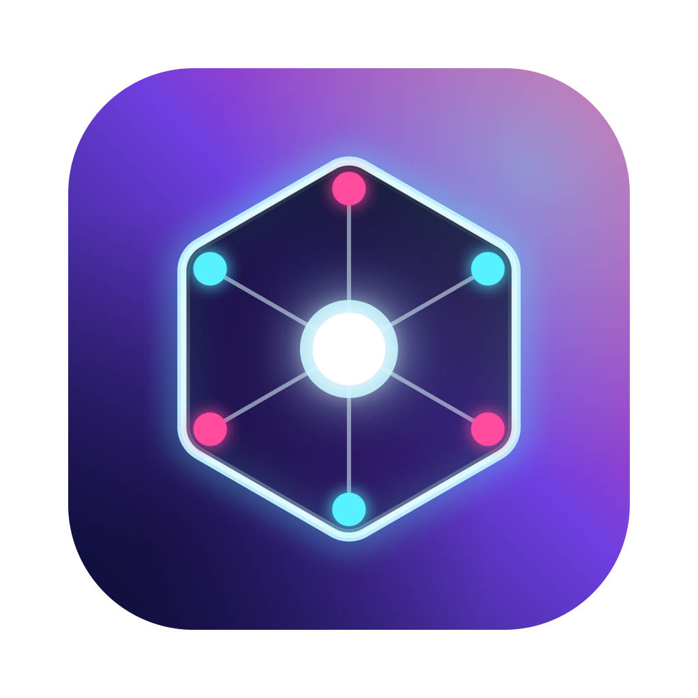

<p align="center">
  <a href="LICENSE"></a>
  
  
  
  
  
  
  <br>
  
  
  
</p>

<p align="center">
  
</p>

# Free-AI-SSD

**Plug in a drive. Ask your AI anything. No internet required.**

Prepare the drive once on a Windows or Mac machine with internet access — download the models, load your documents, and finalize the SSD. PrepApp ships for both hosts: a WPF app on Windows and a native SwiftUI app on Mac, so a Mac-only user can prep without owning a Windows machine. On Windows, the Runner provides the full offline assistant: document-grounded chat, voice I/O, HOTAS PTT, DCS binding import, and the LAN API. The macOS beta Runner provides a subset: RAG-backed chat against an already-indexed library, encrypted config unlock, and the API sidecar. See [Platform Availability](#platform-availability) below for a full feature comparison.

> **New to local AI?** This app runs an AI model *on your own hardware* — nothing is sent to the cloud, and you don't need an account or a subscription. A few terms you'll see below:
> - **Local LLM** — the AI "brain" (a large language model) that runs on your machine instead of a remote server.
> - **Ollama** — the small engine that loads and runs those models locally. Free-AI-SSD bundles it on the drive for you.
> - **Model / GGUF** — a downloadable AI model file (GGUF is the format Ollama uses); you choose which model to stage on the drive.
> - **RAG** — *Retrieval-Augmented Generation*: the AI reads *your* documents and answers from them (citing sources), instead of relying on training data alone.
> - **Embeddings** — how the app turns your documents into searchable math so it can find the right passage to answer a question.
>
> In short: **prep the drive once online, then carry it anywhere and ask questions about your own documents — fully offline.**

**Quick start:** download from [Releases](../../releases), run `FreeAiSsd.PrepApp.exe` (Windows) or `PrepApp.app` (macOS), then follow [Setup & Installation](#setup) below. A condensed version is at [`docs/QUICKSTART.txt`](docs/QUICKSTART.txt).

---

<details>
<summary>📸 Screenshots — Windows (PrepApp)</summary>

<p align="center">
  
</p>
<p align="center">
  
</p>

*Windows PrepApp — Model Manager (top) and Drive Setup (bottom).*

</details>

<details>
<summary>📸 Screenshots — macOS (PrepApp + Runner beta)</summary>

*macOS screenshots coming soon.*

</details>

---

<details>
<summary>🐛 Known issues &amp; status</summary>

&nbsp;

Open bugs, fixes, and feature status are tracked on GitHub rather than hand-maintained here (so this list can't drift out of date):

- **[Open issues](../../issues)** — current known bugs and feature requests
- **[Releases](../../releases)** — per-version changelog and the fixes shipped in each build

</details>

---

## Origin story

This started as a way to take AI into the field with no cell signal — ham radio manuals, band plans, and reference docs loaded onto a pocket SSD so an LLM could answer questions about them miles from civilization. Then it turned out the same setup works really well as a voice-activated copilot in DCS: load aircraft manuals, import your HOTAS bindings, and hit a button on the throttle to ask questions mid-sortie without taking the VR headset off. Same drive. Same AI. Same offline-first idea.

---

<a name="platform-availability"></a>

## Platform Availability

A clear picture of what works where today. Mac support is actively expanding but not yet at feature parity with Windows.

### PrepApp (drive staging — one-time, online)

| Feature | Windows PrepApp | macOS PrepApp |
|---|---|---|
| Format drive | ✅ NTFS or exFAT | ✅ exFAT only |
| Stage Ollama + pull models | ✅ Full | ✅ Full |
| Pull models from Hugging Face | ✅ Full (with token auth) | ✅ Full (with token auth) |
| Manage models on encrypted drives | ✅ Full | ✅ Full |
| Detect pre-configured drive | ✅ Full | ✅ Full |
| Target: Windows-only (NTFS) | ✅ Yes | ❌ macOS cannot format NTFS |
| Target: exFAT (cross-platform or Mac-only) | ✅ Yes | ✅ Yes |
| Encrypted config roundtrip | ✅ Full | ✅ Full (CryptoKit port) |

### Runner (offline assistant — no internet required)

| Feature | Windows Runner | macOS Runner (beta) |
|---|---|---|
| Chat (non-RAG) | ✅ Full | ✅ Full |
| RAG chat (sources panel; inline citations opt-in) | ✅ Full | ⚠️ Query-only — reads a library indexed on Windows |
| Add / sweep / rebuild document library | ✅ Full | ❌ Not supported yet |
| Voice input (speech-to-text) | ✅ Whisper.cpp (fully local) | ✅ On-device dictation (`SFSpeechRecognizer`) |
| Voice output (text-to-speech) | ✅ SAPI + Piper | ✅ Native (`AVSpeechSynthesizer`) |
| HOTAS Push-to-Talk | ✅ DirectInput | ❌ Not ported yet |
| DCS Bindings Import | ✅ Full | ❌ Not supported yet |
| Network Mode (LAN API) | ✅ Full (v2) | ✅ Sidecar-hosted |
| Web chat UI (`/chat/`, browser) | ✅ Full | ✅ Sidecar-hosted |
| Companion tray app (second PC) | ✅ Full | — |
| Headless CLI (RunnerCli) | ✅ Full | — |
| Unlock Windows-prepped encrypted SSD | ✅ Full | ✅ Full (CryptoKit) |

> **RAG on macOS:** The Mac Runner can answer questions using a document library that was ingested and indexed on Windows. It cannot add new documents, watch folders, sweep, or rebuild the index — those operations require the Windows Runner. If you only have a Mac, you can still get RAG-backed answers by preparing the drive on Windows first (or on a second Windows machine).

---

## Features (current state)

### Windows Runner

- ✅ **Portable offline AI** — Ollama staged on the SSD, bound to loopback only; no cloud, no account, no subscription
- ✅ **RAG document library** — PDF / TXT / MD / JSON / CSV with a hybrid retriever (semantic + keyword search) and a Sources panel; optional inline citations like `[guide.pdf §Engine Start p.12]`, plus opt-in OCR to recover text from scanned/diagram pages
- ✅ **DCS World bindings import** — auto-detects Saved Games, scans aircraft, merges stick/throttle/pedals into per-aircraft reference docs for RAG
- ✅ **Voice input (Whisper.cpp)** — fully local STT; Tiny / Base / Small / Medium models
- ✅ **Voice output (TTS)** — Windows SAPI or Piper neural TTS; per-device audio routing
- ✅ **HOTAS Push-to-Talk** — DirectInput joystick button triggers record → transcribe → send → TTS, hands-free; VR-friendly overlay
- ✅ **Network Mode (LAN API v2)** — authenticated HTTP API for chat, streaming chat, STT upload, TTS, and voice-query orchestration
- ✅ **Web chat UI** — install-free browser client served from the LAN API (`http://HOST:41555/chat/`); full assistant minus voice, with model/library pickers, RAG sources, and per-device history. Works from any LAN device including an iPad
- ✅ **Companion tray app** — lightweight Windows client for a second LAN PC; no SSD required; auto-discovers the Runner on the LAN (zero-config), supports its own HOTAS + keyboard PTT loop, and can be auto-bundled + enabled by the Flight Sim setup profile for VR
- ✅ **Headless CLI (`FreeAiSsd.RunnerCli`)** — terminal REPL for SSH/Tailscale access; streams chat, shows RAG sources, zero GUI deps

### Model Management (PrepApp — Windows and macOS)

- ✅ **Hugging Face model pulls** — pull any GGUF model from Hugging Face directly in the Model Manager; token auth, disk-budget warnings, lazy per-quantization row expansion
- ✅ **Ollama model pulls** — standard Ollama registry pull
- ✅ **Model picker** — capability filters, parameter-count cap, Most-popular toggle, sort options
- ✅ **Manage models on encrypted drives** — unlock the drive, add/remove models, re-lock without re-entering setup

### Cross-platform PrepApp

- ✅ **Windows WPF PrepApp** — stages the full Windows payload and optional macOS payloads; NTFS or exFAT; one-time online prep
- ✅ **macOS SwiftUI PrepApp** — native arm64; exFAT only; produces a byte-identical encrypted config and SSD layout to the Windows PrepApp; Apple Silicon (arm64), macOS 11+
- ✅ **Detect pre-configured drive** — both PrepApps recognize an already-staged SSD and offer to continue or reconfigure it
- ✅ **Encrypted config roundtrip** — AES-256-GCM + PBKDF2-SHA256 (210,000 iterations); Mac and Windows use the same on-disk format, pinned by cross-language tests

### macOS Runner (beta)

- 🧪 **Beta** — staged at `<SSD>/Runner.app` (drive root, double-click to launch; no zip to expand)
- ✅ RAG-backed chat (Sources panel; optional inline citations) against a Windows-prepped active library
- ✅ Native voice — on-device dictation (`SFSpeechRecognizer`) and spoken responses (`AVSpeechSynthesizer`); audio never leaves the Mac
- ✅ Encrypted SSD unlock / save (native CryptoKit + CommonCrypto port, byte-compatible with Windows)
- ✅ Network Mode API sidecar (also serves voice-query for a LAN Companion)
- ⚠️ No document management, HOTAS PTT, or DCS import yet

**Known limitations across all platforms:**
- RAG ingestion and index management on macOS: not supported (Windows Runner required)
- Voice upload accepts WAV (PCM 16-bit mono 16kHz) and raw `pcm16le` only; other codecs not implemented
- PDF extraction reads the embedded text layer; scanned/image-only or diagram-heavy PDFs can be recovered with the opt-in built-in OCR (Tesseract, off by default)
- DOCX is not supported (PDF / TXT / MD / JSON / CSV only)
- Direct Ollama LAN exposure is intentionally not supported — Runner API is the only network surface
- IL-2 Sturmovik and War Thunder binding parsers: planned, not yet implemented

### SSH / Tailscale access (CLI)

For headless access from a terminal (including an iPad over Tailscale), `FreeAiSsd.RunnerCli` ships alongside the Windows Runner. It's a thin HTTP client against Runner's LAN API — same RAG pipeline, same source citations, no GUI.

```
$ FreeAiSsd.RunnerCli --help
$ FREEAI_URL=http://my-desk:41555 FREEAI_API_KEY=... FreeAiSsd.RunnerCli --model phi3
Target: http://my-desk:41555
Host reachable (ollamaRunning=True). Type /help for commands. Ctrl-C or 'exit' to quit.
phi3> what aircraft can I fly in DCS Open Beta?
...streamed response...
— sources: dcs-aircraft-list.pdf
phi3> /quit
```

Precedence for configuration: `--url` / `--api-key` flag > `FREEAI_URL` / `FREEAI_API_KEY` env var > default (`http://127.0.0.1:41555`, no key). Use `--no-stream` on very flaky links to fall back to a single-response round-trip.

---

<details>
<summary>🎮 Use Case: Flight Sim Copilot (DCS World)</summary>

You're in VR, mid-sortie, and can't remember the sequence to uncage an AIM-9. You reach for your HOTAS, key the mic, and ask. The AI answers with the buttons on *your* stick — sourced from the aircraft manual sitting on the drive. No internet. No cloud. No subscription.

**What the Windows Runner does for flight sim:**
- Load aircraft manuals (PDF) so the AI can answer procedures, systems questions, and limitations from the actual document
- Import your HOTAS bindings from DCS — it auto-detects your `Saved Games\DCS` folder, scans your aircraft, and writes a per-aircraft reference file with your real button assignments
- Ask by voice while in VR — no headset off, no hands off the stick
- Hear the answer spoken back through your headset via TTS, routed to any audio device you choose

**Supported now in the Windows Runner:** DCS World (stable and Open Beta), any aircraft with binding files in `Config/Input`, multi-device merging (stick + throttle + rudder pedals)

**Planned:** IL-2 Sturmovik and War Thunder binding parsers (see Roadmap)

</details>

<details>
<summary>📻 Use Case: Ham Radio / Field Reference</summary>

Camping, deployed for emergency comms, or away from a desk — you need to reference your radio manual or band plan and there's no cell signal.

Load your manuals and reference documents onto the drive before you go. The AI indexes everything and answers from your own library, completely offline, from a drive that fits in your pocket.

</details>

<details>
<summary>🔒 Use Case: Private Offline AI Assistant</summary>

Maybe you don't trust cloud AI with your data. Maybe your workplace restricts internet access. Maybe you want the same staged SSD available across your machines, with the full feature set on Windows and the current direct-chat beta on macOS.

Prepare the drive once. Your models, your documents, your config — nothing leaves the drive, no account needed, no telemetry.

</details>

<details>
<summary>🏕️ Use Case: Survival / Emergency Reference</summary>

Load first aid guides, plant identification references, equipment specs, survival manuals — whatever you need when there's no connectivity. The AI indexes it all and answers from your library when you're completely off-grid.

</details>

---

<a name="setup"></a>

<details>
<summary>📦 Setup & Installation</summary>

### What You Need

- A portable SSD (most models need 4–8 GB for AI models alone; plan accordingly)
- A Windows **or** Mac machine with internet access for the one-time preparation step. PrepApp ships for both: WPF on Windows, native SwiftUI on Mac. See [Source/Target compatibility](#sourcetarget-compatibility) for which prep host can produce which target filesystem.
- Windows target machines need no pre-installed software — Windows Runner handles staged prerequisites offline.
- Mac host requirements (for PrepApp or Runner): Apple Silicon (arm64) only; macOS 11 Big Sur or newer. Intel Macs are not supported.

<a name="sourcetarget-compatibility"></a>

### Source/Target compatibility

Which prep host (source OS) can produce which target drive:

| Source OS | Target | Filesystem | Supported |
|---|---|---|---|
| Windows | Windows-only | NTFS | Yes |
| Windows | Cross-platform (Windows + Mac) | exFAT | Yes |
| Windows | Mac-only | exFAT | Yes (APFS not available from Windows) |
| Mac | Mac-only | exFAT | Yes (APFS deferred from supported targets) |
| Mac | Cross-platform (Windows + Mac) | exFAT | Yes |
| Mac | Windows-only | NTFS | Not supported — use Windows PrepApp (macOS cannot natively format NTFS) |

**Encrypted-config roundtrip is bidirectional.** A drive prepped on Windows unlocks cleanly on Mac, and a drive prepped on Mac unlocks cleanly on Windows. The on-disk encrypted format (AES-256-GCM + PBKDF2-SHA256) is identical on both platforms and is pinned by cross-language tests.

Notes on the unsupported cells:
- **APFS** is a Mac-native filesystem and Windows cannot reliably create or write to it. APFS targets are deferred; exFAT covers all current Mac use.
- **Mac → Windows-only NTFS** is an OS limitation — macOS does not natively format NTFS. If you need an NTFS-only drive, use Windows PrepApp.
- **exFAT** is the only filesystem Windows and macOS both read and write natively, so cross-platform drives always land on exFAT.

### Download

**Stable (recommended):** Download `Free-AI-SSD-win.zip` from [Releases](../../releases). Extract anywhere on Windows. Run `FreeAiSsd.PrepApp.exe`.

**Beta cross-platform bundle:** `Free-AI-SSD-crossplatform.zip` includes the Mac PrepApp (`PrepApp.app`) and Mac Runner beta (`Runner.app`) alongside the Windows artifacts. The macOS builds are currently unsigned/not notarized — see [macOS first launch](#macos-first-launch-gatekeeper-unblock) below before opening either app.

The download root is intentionally minimal — the prep tool(s), `LICENSE`, `QUICKSTART.txt`, and one `dependencies/` folder for everything the prep tool consumes (no duplicated/nested copies):

```
Free-AI-SSD-win.zip                  Free-AI-SSD-crossplatform.zip
├── FreeAiSsd.PrepApp.exe            ├── FreeAiSsd.PrepApp.exe   (Windows prep)
├── LICENSE                          ├── PrepApp.app             (macOS prep)
├── QUICKSTART.txt                   ├── LICENSE
└── dependencies/                    ├── QUICKSTART.txt
    ├── runner/                      └── dependencies/
    ├── companion/                       ├── runner/  companion/  prereqs/
    └── prereqs/                         └── mac/  (Runner.app, ollama, manifest)
```

> **Cross-platform note:** because macOS `.app` bundles carry symlinks Windows archivers strip, prep a cross-platform drive's **macOS** side *from a Mac* (`PrepApp.app`). The Windows side works from either host. The Mac Runner is staged to the SSD **root** as `<SSD>/Runner.app` — unzipped, launchable directly, no zip to expand each run.

#### macOS first launch (Gatekeeper unblock)

Until the signed/notarized release ships, the unsigned ad-hoc Mac apps trip Gatekeeper as soon as Safari stamps the downloaded ZIP with a quarantine xattr. The dialog reads `"FreeAiSsd is damaged and can't be opened. You should move it to the Trash."` even though nothing is corrupted — and right-click → Open / "Allow apps from anywhere" do **not** clear this state.

Strip the quarantine xattr once in Terminal, replacing the path with wherever you extracted the bundle:

```bash
xattr -dr com.apple.quarantine /path/to/PrepApp.app
xattr -dr com.apple.quarantine /path/to/Runner.app
```

Both apps then launch normally on double-click. This workaround goes away with the next signed release.

**CI artifacts:** Available from GitHub Actions for validation and testing. Prefer Releases for normal use.

### First Run Walkthrough

**Phase 1 — Prepare (online, once):**

On **Windows**:

1. Open `FreeAiSsd.PrepApp.exe`
2. On **Drive Setup**, select your target external SSD, choose target compatibility (Windows-only / Mac-only / cross-platform), and enter a volume label
3. Click **Format & Prepare Drive** (optional — skip if the drive is already formatted the way you want). PrepApp picks the filesystem from your target choice (NTFS for Windows-only, exFAT for anything including Mac), prompts for admin elevation, re-confirms, then formats the volume and lays out the canonical directory structure. If Windows asks to relaunch as admin, accept — the elevated window auto-resumes with your label pre-filled and asks you to confirm once more before formatting.
4. On **Model Manager**, add or select models and pull them (Ollama registry or Hugging Face)
5. Run **Check SSD Readiness** until checks pass
6. Click **Finalize SSD**

On **Mac**:

1. Open `PrepApp.app` from the cross-platform bundle. First launch only: run the [Gatekeeper unblock](#macos-first-launch-gatekeeper-unblock) `xattr` command above — the build is unsigned/not notarized, so Safari quarantine makes Gatekeeper claim the app is "damaged" until that bit is cleared
2. Pick your target external SSD and choose target compatibility (Mac-only or cross-platform — Windows-only NTFS is not available from a Mac host)
3. Confirm the destructive erase in the native confirmation dialog. PrepApp drives `diskutil` directly to format the drive as exFAT and lay out the canonical SSD directory structure
4. Stage the runner, Ollama, and prereq payloads; pull a starter model (Ollama registry or Hugging Face)
5. Optionally enable encryption (off by default — recommended only if you plan to expose the Runner API on your LAN), then run readiness checks and finalize

The resulting drive is byte-for-byte interchangeable with a Windows-prepped drive of the same target compatibility.

**Phase 2 — Run (offline, anywhere):**

1. Plug the SSD into the target machine
2. Run Runner directly from the SSD:
   - Windows: `<SSD>\windows\runner\FreeAiSsd.Runner.exe`
   - macOS beta: `<SSD>/Runner.app` (at the drive root — double-click)
3. Windows: load your documents and start chatting with RAG, citations, voice, HOTAS/PTT, and the LAN API. macOS beta: unlock the SSD if encrypted and start Ollama, then use RAG-backed chat (with native on-device voice in/out) against a library already prepared on Windows (the local chat API host comes up automatically on unlock). Mac document management, HOTAS/PTT, and DCS import are not implemented yet.

### What Needs Internet vs. What Doesn't

| Operation | Internet Required? |
|---|---|
| PrepApp — download, pull, staging | Yes |
| Windows Runner start / chat | No |
| macOS beta Runner start / sidecar-backed chat | No |
| macOS beta Runner — unlock Windows-prepped encrypted SSD | No |
| Reference Documents indexing and retrieval (Windows Runner) | No |
| Pull embedding model (if missing from SSD, Windows Runner) | Once |
| DCS Bindings Import (Windows Runner) | No |
| Voice input (Whisper transcription, Windows Runner) | No (model download is once) |
| Text-to-speech (Windows Runner) | No |

### Troubleshooting

**Runner won't start / dependency warnings**
- Use Runner's **Re-run dependency check**
- If the prereq bundle is missing or invalid, reconnect online and run **Update Prereqs** in PrepApp

**Missing embedding model while offline**
- Start the AI engine and click **Pull embedding model**
- If fully offline, connect temporarily to download it, then return offline

**PDF citations seem wrong or sparse**
- Confirm the PDF has a machine-readable text layer
- For scanned or image-only PDFs, run OCR externally before importing

**.NET / runtime prerequisites on target machine**
- Runner can install staged prerequisites offline when the bundle is valid
- If install is blocked, refresh prerequisites from PrepApp while online and retry

**macOS beta limitations**
- The beta app is a Swift runner plus a local .NET API sidecar. It supports selecting/inferring the SSD, reading installed models, starting macOS Ollama, Network Mode API hosting, native on-device voice (dictation + spoken responses), and RAG-backed chat against an already-indexed active library.
- It unlocks encrypted SSDs prepped on Windows and saves changes back to the encrypted blob. The on-disk format is identical on both platforms; the Mac unlock path is a native CryptoKit + CommonCrypto reimplementation pinned to the C# format by cross-language tests.
- It does not provide document library management, Mac-side ingestion/rebuild/sweep, HOTAS/PTT, or DCS import yet.

### Prereq trust model

Every prerequisite and bundled third-party tool is fetched, verified, and recorded at runtime via a single shared resolver (`shared/Prereqs/PrereqResolver.cs`) used by both PrepApp and the CI offline-bundle builder (`tools/FreeAiSsd.PrereqFetch`). There are no hardcoded per-version SHA pins in the workflow or the catalog — stale pins were the failure mode we were hitting most often. Instead:

| Upstream | Version discovery | Integrity check | Trust basis |
|---|---|---|---|
| **.NET 8 Desktop Runtime (x64)** | `https://builds.dotnet.microsoft.com/dotnet/release-metadata/8.0/releases.json` → `latest-release` (rejects preview/rc builds) | SHA-512 from the same `releases.json` entry | Vendor-published hash over HTTPS to Microsoft's CDN |
| **VC++ Redistributable (x64)** | `https://aka.ms/vs/17/release/vc_redist.x64.exe` evergreen permalink | Observed SHA-256 recorded in manifest only | HTTPS-only trust to Microsoft aka.ms (no vendor per-version hash is published at a predictable URL) |
| **Ollama (macOS, universal)** | GitHub API `releases/latest` → picks `Ollama-darwin.zip` / `ollama-darwin.zip` asset | SHA-256 from the release's `sha256sum.txt` asset | Vendor-published hash over HTTPS to github.com |

Fail-closed invariants (CI and PrepApp both enforce):
- Any non-HTTPS URL anywhere in the chain is rejected before download begins
- A missing or unparseable hash source aborts the bundle
- A SHA mismatch deletes the temp download and throws — no partial installer ever reaches the prereq directory
- Preview / RC .NET builds are refused even if Microsoft publishes them as `latest-release`

The `prereqs-manifest.json` that ships on the SSD records the resolved upstream URL, the vendor hash (when one was available), the observed SHA-256, and a short `trustNote` describing which trust basis was used — so offline installs can be audited without calling back to the upstream.

</details>

---

<details>
<summary>📄 Document Library & RAG</summary>

The Windows Runner includes a **Reference Documents** panel. Add your own files and the AI references them when answering instead of relying on training data alone. Retrieved chunks are cited inline so you can see exactly where an answer came from.

**Supported formats:** `.pdf`, `.txt`, `.md`, `.json`, `.csv`

**Workflow:**

1. Start the AI engine in the Windows Runner
2. In **Reference Documents**, create or select a library
3. Add files (**Add files**) or watch folders (**Add folder**)
4. Run **Sweep folders now** to ingest new or changed files, or **Rebuild index** for a full re-index
5. Ask a question — the library is active

**How retrieval works:** A hybrid retriever combines semantic (vector) search with keyword (BM25) search, fuses the results, and pulls neighboring chunks for surrounding context. The **Sources** list always shows what was used. Inline citations like `[guide.pdf §Engine Start p.12]` are opt-in (`ragInlineCitations`, off by default — answers stay concise) and are stripped before text-to-speech when enabled. If nothing relevant is found, the model is told so and won't invent context.

**macOS:** RAG queries work against a library indexed on Windows. Adding documents, folder sweeps, and index rebuilds require the Windows Runner.

**Limitations:**
- PDF extraction reads the embedded text layer. For scanned/image-only or diagram-heavy PDFs, enable the built-in OCR (`ocrEnabled`, off by default) to recover text from embedded images.
- DOCX is not supported.
- Optimized for personal and small-to-medium libraries (up to ~10,000 chunks; a warning is logged if exceeded).

</details>

<details>
<summary>🕹️ HOTAS Bindings Import</summary>

The Windows Runner reads your DCS World controller bindings and writes them into the document library as a per-aircraft reference file. After import, when you ask "how do I uncage my AIM-9?" the AI answers with the button on *your* stick — not a generic keybind table.

**How to import:**

1. Open **Bindings Import** in the Windows Runner (requires an active document library)
2. The Windows Runner auto-detects your `Saved Games\DCS` folder — browse manually if detection fails
3. Click **Scan** — the Windows Runner lists every aircraft with binding files
4. Select the aircraft and click **Import**
5. The Windows Runner reads each device's `diff.lua` (stick, throttle, rudder pedals), merges them into one file per aircraft, and writes it to your library
6. Run **Rebuild index** or wait for the next folder sweep

**Supported:**
- DCS World stable and Open Beta (auto-detected)
- Any aircraft with binding files in `Config/Input`
- Multi-device merging — stick, throttle, and rudder pedals merged into one file per aircraft

**Not yet supported:** IL-2 Sturmovik and War Thunder (see Roadmap)

</details>

<details>
<summary>🎙️ Voice Assistant (Speech-to-Text & TTS)</summary>

In the Windows Runner, speak your questions and hear the answers. The entire pipeline runs locally — no cloud STT, no cloud TTS.

**Speaking to the AI:**

1. Click the microphone button to start recording
2. Speak your question
3. Click again to stop — Whisper transcribes locally and either sends automatically or places the text in the prompt field for review (controlled by `autoSendVoiceInput`)

**AI voice response:** Enable TTS in settings. Two engines available:
- **System** — Windows SAPI, built-in, no download required
- **Piper** — neural TTS, better quality. Opt in on the PrepApp **Format setup** step (Windows) or the **Drive** step (Mac); PrepApp downloads `piper.exe` (~22 MB) plus the default `en_US-amy-medium` voice (~60 MB) into `windows/tools/piper/` or `mac/tools/piper/`, both SHA-256 verified.

You can route TTS to a specific audio output device — useful for sending AI voice to your VR headset while system audio goes elsewhere.

**Whisper model sizes** (stored at `models/whisper/` on the SSD):

| Size | File | Approx. disk | Notes |
|---|---|---|---|
| Tiny | `ggml-tiny.bin` | ~75 MB | Fastest; lower accuracy |
| Base | `ggml-base.bin` | ~142 MB | Default; good for most use |
| Small | `ggml-small.bin` | ~466 MB | Better accuracy |
| Medium | `ggml-medium.bin` | ~1.5 GB | Best accuracy; more RAM required |

The first time voice is used, Runner downloads the selected Whisper model (internet required for that one step). After that, fully offline.

</details>

<details>
<summary>🎯 Push-to-Talk (HOTAS PTT)</summary>

In the Windows Runner, bind a button on your HOTAS to start and stop voice recording — no keyboard, no mouse. Built for VR where hands-free activation matters.

**Setup:**

1. In settings, enable PTT and select your joystick device (e.g., `"X-56 Rhino Throttle"`)
2. Set the button index and choose a mode:
   - `push_to_talk` — hold the button to record, release to send
   - `toggle` — press once to start recording, press again to stop and send

**Optional overlay:** A small always-on-top window shows recording status. Disable it for VR where it would be distracting (`pttOverlayEnabled`).

**Optional sound:** A short beep plays on PTT activation/deactivation. Toggle with `pttActivationSoundEnabled`.

**Full VR voice loop:** HOTAS button → mic opens → speak → button release → Whisper transcribes → prompt sent → AI responds → TTS speaks into headset. Hands never leave the controls.

**Companion tray app:** Remote HOTAS/PTT is supported — the Companion app can run on a second PC and drive the full voice loop against Runner over LAN, including its own PTT activation beep and overlay.

</details>

<details>
<summary>🌐 Network Mode (Runner LAN API)</summary>

Network Mode lets one Windows machine run Runner + Ollama locally, while other devices on your LAN call Runner's HTTP API.

**Architecture:**
- Ollama binds to loopback only (`127.0.0.1`) on the host machine
- LAN clients talk to **Runner API**, not Ollama directly
- Runner API proxies requests to host-local services (chat, Whisper STT, TTS)
- TTS actions run on the host (the machine running Runner), not on the remote client

**Security model (home LAN baseline):**
- Runner API binds to `127.0.0.1` (loopback) by default. Binding to `0.0.0.0` (all interfaces) is an explicit opt-in set in `portable-config.json`; Runner logs a WARNING on startup whenever the effective bind address is not loopback.
- Non-health endpoints require an API key (`Authorization: Bearer <key>` or `X-API-Key`)
- No TLS/mTLS (assume trusted LAN segment)
- Do not expose this API to the public internet

**Endpoints:**
- `GET /api/health`
- `GET /api/models`
- `POST /api/chat`
- `POST /api/chat/stream` (newline-delimited JSON stream)
- `POST /api/stt/transcribe` (multipart upload: `audio`)
- `POST /api/voice/query` (multipart upload: `audio`, optional `model`, `autoSendToChat`, `speakResponse`, `returnAudio`). When `returnAudio=true` the response includes `AudioBase64` + `AudioMime` so the client can play TTS locally instead of on the host.
- `POST /api/tts/speak`
- `POST /api/tts/stop`

**Example cURL requests:**

```bash
# health (no API key required)
curl http://RUNNER_HOST:41555/api/health

# list models
curl -H "Authorization: Bearer YOUR_KEY" \
  http://RUNNER_HOST:41555/api/models

# non-stream chat
curl -X POST http://RUNNER_HOST:41555/api/chat \
  -H "Authorization: Bearer YOUR_KEY" \
  -H "Content-Type: application/json" \
  -d '{"model":"phi3","prompt":"Summarize startup checklist"}'

# stream chat (NDJSON)
curl -N -X POST http://RUNNER_HOST:41555/api/chat/stream \
  -H "Authorization: Bearer YOUR_KEY" \
  -H "Content-Type: application/json" \
  -d '{"model":"phi3","prompt":"Step-by-step A-10C startup"}'

# trigger host-side TTS
curl -X POST http://RUNNER_HOST:41555/api/tts/speak \
  -H "Authorization: Bearer YOUR_KEY" \
  -H "Content-Type: application/json" \
  -d '{"text":"Radio check complete."}'

# STT transcription (WAV upload)
curl -X POST http://RUNNER_HOST:41555/api/stt/transcribe \
  -H "Authorization: Bearer YOUR_KEY" \
  -F "audio=@question.wav;type=audio/wav"

# Voice query (upload -> transcribe -> chat -> optional host-side TTS)
curl -X POST http://RUNNER_HOST:41555/api/voice/query \
  -H "Authorization: Bearer YOUR_KEY" \
  -F "audio=@question.wav;type=audio/wav" \
  -F "model=phi3" \
  -F "autoSendToChat=true" \
  -F "speakResponse=true"

# Voice query with client-side TTS playback (returnAudio)
# Response JSON contains AudioBase64 + AudioMime ("audio/wav") for local playback.
curl -X POST http://RUNNER_HOST:41555/api/voice/query \
  -H "Authorization: Bearer YOUR_KEY" \
  -F "audio=@question.wav;type=audio/wav" \
  -F "model=phi3" \
  -F "autoSendToChat=true" \
  -F "speakResponse=true" \
  -F "returnAudio=true"
```

**Remote voice upload formats and limits:**
- Supported: WAV (PCM 16-bit mono 16kHz), raw PCM16LE (`format=pcm16le`)
- Upload size limit controlled by `networkMaxAudioUploadMB`
- Invalid type / empty payload / oversize uploads return clear 4xx errors
- `returnAudio=true` returns synthesized TTS as WAV PCM 16-bit mono 16kHz (`AudioMime: "audio/wav"`, `AudioBase64`), bounded by `networkMaxAudioUploadMB`

**Web chat / LAN access (no install):**

Runner serves a standalone browser chat client from the same LAN API host — no app to install on the other device. It's the full assistant minus voice: model picker, document-library selection, RAG-grounded chat with sources, a collapsible thinking view, and per-request temperature/thinking controls. Chat history is saved per-device in the browser (localStorage).

**On the host PC** the web UI runs on loopback automatically whenever Ollama is up — just click **"Open Chat UI"** in Runner (or open `http://127.0.0.1:41555/chat/`). No Network Mode, no API key for local use.

**To reach it from other devices:**
1. On the host, tick **"Expose API on my LAN"** in Runner's *Web chat UI & LAN access* settings (encrypted drive only — the same opt-in that powers the Companion app).
2. Allow inbound TCP **41555** through the host firewall.
3. From any LAN device — including an iPad on the sim rig — open `http://RUNNER_HOST:41555/chat/` (use the host's LAN IP or `HOSTNAME.local`).
4. Enter the host's API key once when prompted; it's stored only in that browser. Change the host/key later from the in-app **Settings**.

Per-request model parameters set in the web UI (temperature, thinking) apply only to that request and never overwrite the host's saved configuration. Plain HTTP over a trusted home LAN, API-key gated — do not expose port 41555 to the public internet.

</details>

---

<details>
<summary>⚙️ Configuration Reference</summary>

All settings live in `config/portable-config.json` on the SSD.

### Core

| Property | Default | Description |
|---|---|---|
| `ollamaPort` | `11434` | TCP port for the local Ollama server |
| `preferredCompute` | `"auto"` | Compute mode: `"auto"` (detected GPU — AMD→Vulkan, NVIDIA→CUDA, Intel→Vulkan) or `"cpu"` (force CPU). Legacy `"cuda"`/`"rocm"` are treated as `"auto"` |
| `useStreamingChat` | `true` | Stream tokens as they generate; falls back to non-streaming if streaming fails |

### Chat model parameters

Per-chat overrides for the active model. Sentinel values mean "use the model's built-in default," so the app stays compatible with any GGUF model. The web/desktop UI can set these per request without changing the saved config.

| Property | Default | Description |
|---|---|---|
| `modelContextWindow` | `0` | Override Ollama `num_ctx`; `0` = model default |
| `modelTemperature` | `-1` | Override `temperature` (0.0–2.0); `-1` = model default |
| `modelTopP` | `-1` | Override `top_p` (0.0–1.0); `-1` = model default |
| `modelMaxOutputTokens` | `-1` | Override `num_predict` (max tokens per response); `-1` = unbounded. Also caps the thinking budget. |
| `modelThinkMode` | `""` | Reasoning control: `""` = model default, `"off"`, `"low"`, `"medium"`, `"high"` (only for models that support thinking) |

### Document Library & RAG

| Property | Default | Description |
|---|---|---|
| `activeDocumentLibraryId` | `null` | Active library ID; `null` disables RAG |
| `retrievalTopK` | `8` | Number of chunks retrieved per query |
| `hybridRetrievalEnabled` | `true` | Fuse semantic (vector) + keyword (BM25) search; `false` = vector-only. No reindex needed. |
| `retrievalNeighborRadius` | `1` | Chunks pulled on each side of a hit for context; `0` disables |
| `ragInlineCitations` | `false` | `true` appends inline labels like `[guide.pdf §Engine Start p.12]` (stripped before TTS); `false` = concise answers, sources still shown in the Sources panel |
| `chunkSize` | `1200` | Characters per chunk during indexing |
| `chunkOverlap` | `200` | Characters of overlap between adjacent chunks |
| `embeddingModelName` | `"nomic-embed-text"` | Embedding model served by local Ollama |
| `minimumSimilarityThreshold` | `0.3` | Minimum cosine similarity (0.0–1.0) for a chunk to be included; lower = more permissive |
| `maxEmbeddingConcurrency` | `4` | Concurrent embedding requests during ingestion |
| `maxDocumentSizeMB` | `512` | Max file size (MB) accepted for ingestion |

### Document OCR (opt-in)

Off by default. When enabled (and a Tesseract bundle is staged on the SSD), OCR recovers text baked into images inside PDFs (e.g. cockpit MFD labels, diagrams) and adds it as supplementary searchable chunks — the clean text layer is never replaced.

| Property | Default | Description |
|---|---|---|
| `ocrEnabled` | `false` | Run OCR over embedded PDF images during ingestion |
| `ocrLanguage` | `"eng"` | Tesseract language code(s) passed to `-l` |
| `ocrMinImagePixels` | `10000` | Skip images smaller than this (width × height) — filters out icons, rules, logos |
| `ocrMinWordConfidence` | `55` | Drop OCR words below this confidence (0–100) to suppress garble |
| `ocrMaxImagesPerFile` | `4000` | Hard cap on images OCR'd per file |
| `ocrPerImageTimeoutSeconds` | `30` | Per-image OCR timeout (a stuck image is skipped) |

### Voice — Speech-to-Text

| Property | Default | Description |
|---|---|---|
| `whisperModelSize` | `"Base"` | Whisper model: `"Tiny"`, `"Base"`, `"Small"`, or `"Medium"` |
| `selectedMicrophoneDevice` | `null` | Microphone device name; `null` = system default |
| `autoSendVoiceInput` | `true` | `true` sends transcribed text immediately; `false` puts it in the prompt field for review |

### Voice — Text-to-Speech

| Property | Default | Description |
|---|---|---|
| `ttsEnabled` | `false` | Enable TTS for AI responses |
| `ttsEngine` | `"system"` | `"system"` (Windows SAPI) or `"piper"` (neural TTS) |
| `ttsVoiceName` | `null` | Voice name for the selected engine; `null` = engine default |
| `ttsRate` | `0` | Speech rate: `-10` (slowest) to `10` (fastest) |
| `ttsVolume` | `100` | Volume: `0` (silent) to `100` (max) |
| `ttsOutputDevice` | `null` | Audio output device for TTS; `null` = system default |

### Push-to-Talk (HOTAS PTT)

| Property | Default | Description |
|---|---|---|
| `pttEnabled` | `false` | Enable HOTAS push-to-talk |
| `pttDeviceName` | `null` | DirectInput device name (e.g., `"X-56 Rhino Throttle"`) |
| `pttButtonIndex` | `0` | Zero-based button index on the joystick device |
| `pttMode` | `"push_to_talk"` | `"push_to_talk"` (hold to record) or `"toggle"` (press to start/stop) |
| `pttActivationSoundEnabled` | `true` | Play a beep on PTT activation/deactivation |
| `pttOverlayEnabled` | `true` | Show the always-on-top PTT status overlay |
| `pttOverlayX` / `pttOverlayY` | `20` / `20` | Overlay window position in pixels from top-left |

The Companion tray app exposes the same two cues under identical key names (`pttActivationSoundEnabled`, `pttOverlayEnabled`) in `companion-config.json`, toggleable from Companion's Settings window.

### Network Mode (Runner LAN API)

| Property | Default | Description |
|---|---|---|
| `networkModeEnabled` | `false` | Expose the Runner API on the LAN. The API always runs on loopback when Ollama is up (for the on-PC web UI); this flag rebinds it to `networkBindAddress` and enforces the API key. |
| `networkBindAddress` | `"127.0.0.1"` | Bind address used when exposed on the LAN (typically `0.0.0.0`). Ignored — forced to loopback — when `networkModeEnabled` is off. |
| `networkPort` | `41555` | TCP port for Runner API |
| `networkApiKey` | `""` | Shared secret for API auth |
| `networkRequireApiKey` | `true` | Require API key on all non-health endpoints |
| `networkAllowTts` | `false` | Allow remote callers to trigger host-side TTS |
| `networkAllowRemoteStt` | `false` | Allow remote audio upload transcription via `/api/stt/transcribe` |
| `networkAllowRemoteVoiceQuery` | `false` | Allow remote voice-query orchestration via `/api/voice/query` |
| `networkVoiceAutoSendToChat` | `true` | Default for voice query: auto-send transcription to chat when request omits override |
| `networkMaxAudioUploadMB` | `10` | Maximum upload size in MB for remote STT/voice endpoints |

</details>

---

<details>
<summary>🗺️ Roadmap</summary>

### Shipped

**Core infrastructure:**
- ✅ Portable offline AI (Ollama on SSD, Windows + macOS)
- ✅ Encrypted config (AES-256-GCM + PBKDF2-SHA256), bidirectional roundtrip Mac ↔ Windows
- ✅ Offline Windows prerequisite bundle (.NET 8 + VC++ redist, SHA-verified, no hardcoded pins)
- ✅ Detect pre-configured drive (both PrepApps recognize an already-staged SSD)
- ✅ Manage models on encrypted drives (Windows + Mac PrepApp)

**Windows Runner (full feature set):**
- ✅ RAG document library (PDF / TXT / MD / JSON / CSV) — hybrid retrieval (semantic + BM25), section-aware chunking, opt-in inline citations, SIMD vector search
- ✅ Opt-in PDF-image OCR (Tesseract) — recovers text from scanned/diagram pages
- ✅ DCS World bindings import (auto-detect, multi-device merge)
- ✅ Voice pipeline (Whisper.cpp STT + Windows SAPI / Piper TTS)
- ✅ HOTAS Push-to-Talk (DirectInput, VR-friendly overlay)
- ✅ Network Mode v2 (LAN API, streaming, STT/TTS endpoints)
- ✅ Companion tray app — second-PC client, zero-config LAN auto-discovery, HOTAS + keyboard PTT, `returnAudio` local TTS
- ✅ Setup profiles (Flight Sim / General Assistant) — profile-tuned defaults at prep time and in Runner; Flight Sim auto-bundles the Companion
- ✅ Headless CLI (RunnerCli — SSH/Tailscale terminal access)

**Model management (Windows + Mac):**
- ✅ Hugging Face model pulls (token auth, disk-budget warnings, per-quant expansion)
- ✅ Ollama registry model pulls
- ✅ Model picker (capability filters, parameter cap, Most-popular toggle, sort)
- ✅ Model parameter controls — per-chat `num_ctx` / temperature / `top_p` / max-output (`num_predict`), plus a **Thinking** control (Ollama `think`: Off / Low / Medium / High) to disable or cap reasoning models that loop; live on both the Windows and Mac runners

**macOS:**
- ✅ Native SwiftUI PrepApp (arm64, exFAT, byte-identical SSD layout to Windows PrepApp)
- 🧪 macOS Runner beta (RAG-backed chat, native on-device voice in/out, encrypted unlock, Network Mode sidecar — also serves voice-query for a LAN Companion)

### In Progress

- 🔄 **Windows HF token persistence on encrypted drives** — HF credentials currently don't write back through the encrypted config path on Windows; fix in progress
- 🔄 **Document replacement edge cases** — hardening replace + rebuild for unusual file rename/hash scenarios

### Planned

- 📋 **Mac document library management** — add/sweep/rebuild from the Mac Runner (currently read-only against a Windows-prepped library)
- 📋 **Mac HOTAS PTT / DCS import** — remaining Mac Runner parity items (native voice in/out already shipped)
- 📋 **IL-2 Sturmovik and War Thunder binding parsers** — pending example binding files
- 📋 **Copilot persona prompts** — extend the shipped Flight Sim / General Assistant profiles with curated, profile-specific system prompts

</details>

---

<details>
<summary>🔧 Architecture & Technical Details</summary>

### How It's Structured

Free-AI-SSD ships several components backed by a shared cross-platform library:

- **PrepApp** (Windows, WPF — `prep-app/`) — runs on an online Windows machine to configure the SSD: picks drive, downloads and stages Ollama, pulls models (Ollama or Hugging Face), bundles prerequisites, finalizes layout
- **Mac PrepApp** (`mac-prep-app/`, SwiftUI) — native macOS PrepApp for the cross-platform bundle. Drives `diskutil` directly to format target SSDs as exFAT, stages the runner / Ollama / prereq payloads via the `mac-prep-host` net8.0 sidecar (which consumes `prep-core/`), and writes encrypted config in a format byte-identical to the Windows PrepApp. Apple Silicon (arm64), macOS 11+
- **Runner** (Windows, WPF — `runner/`) — runs from the SSD on the target machine; starts Ollama, provides the chat interface, manages document libraries, voice pipeline, HOTAS PTT, and the LAN API host
- **macOS Runner beta** (`mac-runner/`, Swift) — thin macOS app shipped at `<SSD>/Runner.app` (drive root). It selects/infers the SSD, unlocks encrypted config, reads installed models, starts macOS Ollama, spawns the local Runner API sidecar, and sends chat through the shared RAG pipeline when an active indexed library exists
- **Voice Pipeline** (inside Runner's service layer) — `AudioCaptureService` → `WhisperSpeechToTextService` → `ChatService` → `SystemTextToSpeechService` / `PiperTextToSpeechService`, orchestrated by `PttVoicePipelineService` when HOTAS PTT is enabled
- **Bindings Parser** (inside the shared library at `shared/Documents/`) — `DcsSavedGamesLocator` finds DCS installs, `DcsAircraftScanner` enumerates aircraft, `DcsBindingParser` parses `diff.lua`, `DcsBatchProcessor` merges devices and writes RAG documents
- **Companion** (`companion/`, WPF tray app) — optional lightweight client for a second LAN machine; no SSD required; talks to the Runner LAN API for chat / STT upload / voice-query / host-side TTS. Supports its own HOTAS PTT loop, activation beep, status overlay, and mic-preflight check
- **Shared library** (`FreeAiSsd.Shared`, `net8.0`) — common core logic for encryption, trust policy, path guards, config, dependency checking, download management, MVVM infrastructure, DCS binding models, document library, and RAG pipeline

### Service Layer (Runner)

Runner's business logic lives in injectable services with no UI dependencies, enabling unit testing without a WPF host:

| Service | Purpose |
|---|---|
| `OllamaLifecycleService` | Process start/stop, port resolution, trust validation |
| `ModelManagementService` | Installed model listing, sizing warnings, embedding model pull |
| `DocumentOperationsService` | Library CRUD, file ingestion, folder sweep, index rebuild |
| `ChatService` | RAG-augmented prompt construction and Ollama `/api/generate` calls |
| `DcsBindingsImportService` | DCS installation detection, aircraft scanning, batch binding import |
| `WhisperSpeechToTextService` | Whisper.cpp transcription via `Whisper.net`; model download management |
| `SystemTextToSpeechService` | Windows SAPI TTS with optional NAudio device targeting |
| `PiperTextToSpeechService` | Piper neural TTS; spawns `piper.exe`, streams raw PCM through NAudio |
| `AudioCaptureService` | Microphone capture at 16 kHz/16-bit mono (Whisper's required format) |
| `HotasInputService` | DirectInput polling for HOTAS PTT button state |
| `PttVoicePipelineService` | Orchestrates the full PTT → record → transcribe → send → TTS loop |

### RAG Pipeline

- **Cosine similarity threshold** — chunks below `minimumSimilarityThreshold` (default 0.3) are discarded; the model is told explicitly when nothing relevant was found
- **Binary BLOB embedding storage** — stored as raw binary in SQLite instead of JSON text; reduces index size ~60% and eliminates serialization overhead; existing indexes migrate automatically on first open
- **Parallel ingestion** — embeds chunks concurrently under a bounded concurrency cap (`maxEmbeddingConcurrency`)
- **SIMD-optimized vector search** — embeddings pre-normalized at write time; search reduces to a dot product via `System.Numerics.Vector<float>`; top-K uses an O(N log K) priority queue

### Security

| Control | Detail |
|---|---|
| Encrypted config | AES-256-GCM with PBKDF2-SHA256 (210,000 iterations) |
| Config write guard | `ConfigStore` is the only path for config writes; a plaintext write to an encrypted drive throws `InvalidOperationException` (fail-closed) |
| Package trust | Ollama downloads validated against URL allowlist + SHA-256 digest before execution; macOS payloads additionally verified as arm64 Mach-O |
| Fail-closed write guard | `PrepDriveWriteGuard` blocks all writes to encrypted drives if encryption state is ambiguous |
| Path traversal prevention | `PathGuards` enforces sibling boundary checks with platform-aware case sensitivity |
| Shell injection prevention | `ProcessRunner` uses `ArgumentList`, not string concatenation |

A security review on 2026-02-19 found no critical vulnerabilities in the audited surface. The invariants above are enforced in code and tests; ongoing issues are tracked on [GitHub Issues](../../issues).

### SSD Directory Layout

```
config/                   — portable-config.json (plaintext) or portable-config.encrypted.json (opt-in)
models/                   — Ollama model store
models/whisper/           — Whisper STT model files (ggml-*.bin)
logs/                     — app logs
docs/libraries/           — Reference Documents library files, manifests, index DB
windows/runner/           — Runner app
windows/tools/ollama/     — staged Ollama runtime + trust attestation
windows/tools/piper/      — optional Piper TTS binary and voice models (user-installed)
windows/tools/tesseract/  — optional Tesseract OCR engine + tessdata
windows/tools/prereqs/    — offline prerequisite installers + manifest
Runner.app/               — macOS Runner bundle (root-level, launchable directly)
mac/tools/ollama/         — staged macOS Ollama runtime + trust attestation
mac/tools/piper/          — optional Piper TTS binary and voice models
mac/tools/tesseract/      — optional Tesseract OCR engine + tessdata
cache/                    — prep-time download cache
```

`SsdLayout` in the shared library is the single source of truth for these paths — always use it rather than constructing paths manually.

### Project Structure

| Directory | Target | Purpose |
|---|---|---|
| `shared/` | `net8.0` | Cross-platform shared library (`FreeAiSsd.Shared`) |
| `runner-core/` | `net8.0` | Platform-neutral Runner business logic (chat, RAG, library, local API) shared by Windows Runner and the Mac runner-host sidecar |
| `prep-core/` | `net8.0` | Platform-neutral PrepApp business logic (manifest, staging, prereq, encrypted config, HF/Ollama model pulls) shared by Windows PrepApp and the Mac prep-host sidecar |
| `prep-app/` | `net8.0-windows` | WPF PrepApp (Windows) |
| `mac-prep-app/` | macOS (Swift) | Native SwiftUI PrepApp (Mac); produces drives byte-identical to Windows PrepApp |
| `mac-prep-host/` | `net8.0` | osx-arm64 sidecar that runs `prep-core/` business logic for the Mac PrepApp over a stdin command protocol |
| `runner/` | `net8.0-windows` | WPF Runner (Windows) |
| `mac-runner/` | macOS (Swift) | Swift macOS beta Runner over the local Runner API sidecar |
| `mac-runner-host/` | `net8.0` | osx-arm64 sidecar that hosts `RunnerLocalApiService` for the Mac Runner |
| `runner-cli/` | `net8.0` | Headless CLI client (`FreeAiSsd.RunnerCli`) — SSH/Tailscale terminal access to Runner API |
| `companion/` | `net8.0-windows` | WPF Companion tray client (LAN second-PC use) |
| `tools/FreeAiSsd.PrereqFetch/` | `net8.0` | CI helper that pre-builds the offline prereq bundle via the shared `PrereqResolver` |
| `tests/` | `net10.0` | xUnit test project (`FreeAiSsd.Tests`) |
| `tests-ocr/` | `net10.0` | xUnit OCR test project (`FreeAiSsd.Tests.Ocr`) — Tesseract OCR coverage |
| `docs/` | — | Documentation (includes `QUICKSTART.txt`) |

### Shared Library Components

| File | Purpose |
|---|---|
| `DependencyChecker.cs` | Detects missing VC++ / .NET runtimes via registry + process checks |
| `DownloadManager.cs` | Resumable HTTP downloads with progress callbacks |
| `DriveInspector.cs` | Enumerates candidate drives |
| `ModelSizing.cs` | Maps model tags to RAM/VRAM/disk requirements for sizing warnings |
| `NetUtils.cs` | Port availability checking |
| `OllamaPackageTrustPolicy.cs` | URL allowlisting + SHA-256 digest verification |
| `PathGuards.cs` | Path traversal prevention |
| `PortableConfig.cs` | JSON config serialization with atomic writes |
| `PrepDriveWriteGuard.cs` | Blocks writes to encrypted drives (fail-closed) |
| `PrereqInstallValidator.cs` | Validates installer integrity (SHA-256) before execution |
| `Prereqs/PrereqResolver.cs` | Runtime discovery of the latest stable upstream prereq versions + vendor-hash verification. Shared by PrepApp and CI. |
| `ProcessRunner.cs` | Safe process spawning via `ArgumentList`, not string concatenation |
| `SsdEncryption.cs` | AES-256-GCM config encryption |
| `SsdLayout.cs` | Canonical directory structure constants and creation |
| `SsdLogger.cs` | File-based logger writing to the SSD's logs directory |
| `SystemCompatibility.cs` | GPU/CPU/OS detection for compatibility display |
| `Documents/DcsBindingParser.cs` | Parses DCS `diff.lua` files into structured data for RAG |
| `Documents/DcsAircraftScanner.cs` | Scans `Config/Input` for aircraft folders and device files |
| `Documents/DcsBatchProcessor.cs` | Batch import: merges devices, formats output, writes to library |
| `Documents/DcsSavedGamesLocator.cs` | Auto-detects `Saved Games\DCS` and `.openbeta`; supports manual override |

### MVVM Design

- `PrepViewModel` lives in `shared/` (`net8.0`) so it can be unit tested on Linux without WPF
- `IDialogService` abstracts all `MessageBox`/dialog interactions
- Service interfaces in `shared/`, implementations in `prep-app/Services/` (`net8.0-windows`)
- `MainWindow.xaml.cs` reduced from ~1,800 lines to ~95 lines; all logic in `PrepViewModel` and services
- Moq 4.20.72 used for mocking in tests

### Build

**Shared + tests (all platforms):**
```powershell
dotnet build shared/FreeAiSsd.Shared.csproj
dotnet build tests/FreeAiSsd.Tests.csproj
dotnet test tests/FreeAiSsd.Tests.csproj --verbosity normal
```

> 1 test (`IsPathUnderRoot_WindowsBoundaryIsRespected`) is expected to fail on Linux — it tests Windows-specific path behavior.

**Full build (Windows only):**
```powershell
dotnet restore FreeAiSsd.sln
dotnet build FreeAiSsd.sln -c Release
dotnet test FreeAiSsd.sln -c Release
```

**Stage Runner payload into PrepApp output:**
```powershell
./build.ps1 -Configuration Release -Runtime win-x64
```

**Key dependencies:** xUnit, System.Management, Moq, PdfPig, SharpDX (DirectInput), ASP.NET Core (in-process LAN host), Microsoft.Extensions.DependencyInjection, SQLite

### Test Coverage

~1,000+ test cases (`[Fact]`/`[Theory]`; Theories expand to more at runtime) across ~100 test files in `tests/` and `tests-ocr/`. One Windows-specific path test is expected to fail on Linux. Coverage spans:

- DCS binding parsing, aircraft scanning, and batch import
- The RAG pipeline — chunking, hybrid retrieval, RRF fusion, citations, neighbor expansion, and OCR
- Encryption, prereq trust/integrity, path guards, and the fail-closed write guard
- Mac ↔ Windows cross-language encrypted-config parity
- The LAN API, RunnerCli, Companion config, and model management (HF + Ollama pulls)

CI (`.github/workflows/build.yml`) is the source of truth for the current count and pass/fail status.

### macOS Signing and Notarization

Signing is disabled by default in CI (`MAC_SIGNING_ENABLED=false`). Supported via repository secrets: `MACOS_CERT_P12_BASE64`, `MACOS_CERT_PASSWORD`, `APPLE_TEAM_ID`, `APPLE_ID`, `APPLE_APP_SPECIFIC_PASSWORD`, `MACOS_SIGN_IDENTITY`.

### Changelog

See [GitHub Releases](../../releases) for the full version history and release notes.

</details>
